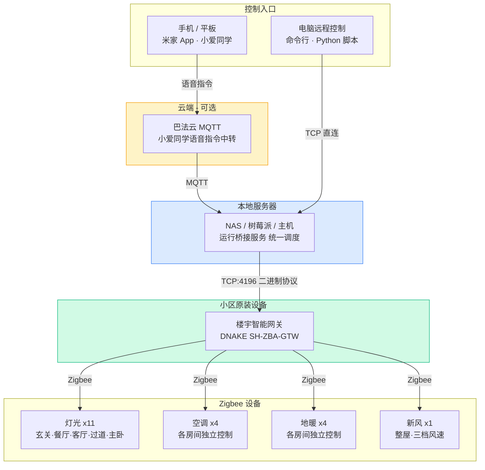

# smart-home-zigbee

通过 Zigbee 网关 TCP 协议控制狄耐克 (DNAKE) 智能家居设备（灯光、场景、新风、空调、地暖）。

> 适用于 SH-ZBA-GTW 系列 Zigbee 网关。
>
> 纯局域网控制，不依赖厂商云端，无需额外购买任何硬件。

## 系统架构



## 已实现功能

| 功能 | 状态 | 说明 |
|------|:----:|------|
| 💡 灯光控制 | ✅ | 11 盏全覆盖，单灯 / 区域 / 场景一键切换 |
| 🎬 场景控制 | ✅ | 硬件场景触发 + 自定义软件组合场景 |
| 🌬️ 新风系统 | ✅ | 整屋新风，低 / 中 / 高三档风速 |
| 🗣️ 小爱同学 | ✅ | 语音控制：「小爱，开客厅灯」 |
| 💻 远程控制 | ✅ | 命令行 + Python API，可集成到任何自动化平台 |
| ❄️ 空调控制 | ✅ | 各房间独立，冷暖 / 除湿 / 送风 / 温度设定 |
| 🔥 地暖控制 | ✅ | 各房间独立，远程温度设定 |

## 所需设备

| 设备 | 说明 |
|------|------|
| 本地服务器 | NAS、树莓派或任意常开主机（运行桥接服务） |
| 楼宇智能网关 | 小区原装 DNAKE 网关（已配，无需购买） |
| 米家 App | 绑定巴法云后即可语音控制（可选） |

> **无需更换任何灯具或硬件**，直接利用小区精装房自带的智能家居系统。

## 快速开始

### 1. 安装

```bash
git clone https://github.com/jupiter2021/smart-home-zigbee.git
cd smart-home-zigbee
pip install -e .
```

### 2. 配置

```bash
cp config.example.yaml config.yaml
# 编辑 config.yaml，填入你的网关 IP 和设备地址
# 获取设备地址的方法见 docs/device-discovery.md
```

### 3. 使用

```bash
smz on all              # 全开
smz off 客厅            # 关闭客厅所有灯
smz on 客厅主灯         # 开单灯
smz scene 回家          # 执行「回家」场景
smz fresh-air on        # 开新风
smz ac on 客厅空调      # 开空调
smz ac temp 客厅空调 24 # 空调设24度
smz heat on 客厅地暖    # 开地暖
smz heat temp 客厅地暖 24 # 地暖设24度
smz list                # 查看设备列表
```

## Python API

```python
from smart_home_zigbee import Gateway, LightController, load_config
from smart_home_zigbee.scene import SceneController
from smart_home_zigbee.fresh_air import FreshAirController

config = load_config()

with Gateway(config.gateway.ip) as gw:
    # 灯光
    lights = LightController(gw, config.lights)
    lights.on("客厅主灯")      # 开单灯
    lights.off("主卧")         # 关一个区域
    lights.on()                # 全开

    # 场景
    scenes = SceneController(
        gw, config.hardware_scenes, config.software_scenes, lights
    )
    scenes.execute("回家")              # 触发硬件场景
    scenes.execute("会客")              # 触发软件组合场景
    scenes.execute("会客", on=False)    # 关闭组合场景

    # 新风
    fa = FreshAirController(gw, config.fresh_air)
    fa.on(speed="high")    # 开启 + 高风
    fa.set_speed("low")    # 调风速
    fa.off()               # 关闭

    # 空调
    from smart_home_zigbee.ac import ACController
    ac = ACController(gw, config.acs)
    ac.on("客厅空调")               # 开启（保持上次模式）
    ac.set_temp("客厅空调", 24)     # 设温度
    ac.set_mode("客厅空调", "cool") # 制冷模式
    ac.set_speed("客厅空调", "auto") # 自动风速
    ac.off("客厅空调")              # 关闭

    # 地暖
    from smart_home_zigbee.heat import FloorHeatingController
    heat = FloorHeatingController(gw, config.heats)
    heat.on("客厅地暖")             # 开启
    heat.set_temp("客厅地暖", 24)   # 设温度
    heat.off("客厅地暖")            # 关闭
```

## 命令行参考

| 命令 | 说明 |
|------|------|
| `smz on [目标]` | 开灯（灯名 / 区域名 / all） |
| `smz off [目标]` | 关灯 |
| `smz scene <名称> [--off]` | 执行场景 |
| `smz fresh-air on\|off\|speed` | 新风控制（`--speed low\|mid\|high`） |
| `smz ac <action> <名称> [值]` | 空调控制（action: on/off/temp/mode/speed） |
| `smz heat <action> <名称> [值]` | 地暖控制（action: on/off/temp） |
| `smz list [lights\|scenes\|acs\|heats]` | 查看设备或场景列表 |

## 小爱同学语音控制（可选）

通过巴法云 (Bemfa) MQTT 桥接，实现「小爱同学，开客厅灯」语音控制。

### 配置步骤

1. **安装 MQTT 依赖**
   ```bash
   pip install smart-home-zigbee[mqtt]
   ```

2. **注册巴法云账号**
   - 前往 [cloud.bemfa.com](https://cloud.bemfa.com) 注册，获取私钥（Private Key）
   - 在控制台创建 MQTT 主题（Topic），命名规则：
     - 以 `002` 结尾 → 巴法云识别为「灯」（如 `ketingzd002`）
     - 以 `006` 结尾 → 巴法云识别为「开关」（如 `xinfeng006`）

3. **米家 App 连接第三方平台**
   - 打开米家 App → **我的** → **连接三方平台** → **添加** → 搜索 **巴法**
   - 绑定你的巴法云账号，绑定成功后巴法云创建的设备会自动同步到米家

4. **编辑 config.yaml**
   ```yaml
   bemfa:
     enabled: true
     key: "你的巴法云私钥"    # 或通过环境变量 BEMFA_KEY 设置
   ```

5. **启动桥接服务**
   ```bash
   python examples/bemfa_bridge.py
   ```

启动后就可以对小爱同学说「开客厅灯」「关全部灯」「开新风」等指令了。

> 桥接脚本需要保持运行，建议部署在树莓派或家中常开的设备上，可配合 `systemd` 或 `pm2` 实现开机自启。

详见 [examples/bemfa_bridge.py](examples/bemfa_bridge.py)。

## 文档

| 文档 | 说明 |
|------|------|
| [docs/protocol.md](docs/protocol.md) | 二进制协议完整规格 |
| [docs/light-control.md](docs/light-control.md) | 灯光控制详解 |
| [docs/scene-control.md](docs/scene-control.md) | 场景机制（硬件场景 vs 软件组合） |
| [docs/fresh-air-control.md](docs/fresh-air-control.md) | 新风命令参考 |
| [docs/ac-control.md](docs/ac-control.md) | 空调控制详解 |
| [docs/heat-control.md](docs/heat-control.md) | 地暖控制详解 |
| [docs/device-discovery.md](docs/device-discovery.md) | 如何获取你家的设备地址 |

## 兼容性

- **网关**：DNAKE SH-ZBA-GTW（Silicon Labs MG21-D 芯片）
- **面板**：狄耐克智能家居楼宇对讲面板（Android 系统）
- **Python**：3.10+
- **系统**：macOS / Linux / Windows

## 打赏支持

这个项目花了大量时间研究协议、反复测试验证，才把狄耐克的私有协议搞通。如果帮你省下了折腾的时间，欢迎请作者喝杯咖啡：

<table align="center">
  <tr>
    <td align="center"><br><b>微信</b></td>
    <td align="center"><br><b>支付宝</b></td>
  </tr>
</table>

你的支持是我持续维护、适配更多设备（空调/地暖/窗帘）的动力！

遇到问题也欢迎 [提 Issue](https://github.com/jupiter2021/smart-home-zigbee/issues)，打赏用户优先回复。

## Star History

如果觉得有用，请给个 Star 让更多人看到：

[](https://star-history.com/#jupiter2021/smart-home-zigbee&Date)

## License

[MIT](LICENSE)
